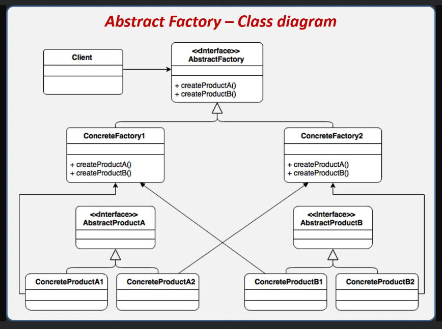

### 1. What's the main difference between **Factory Method** and **Abstract Factory** ?
- **Factory Method** helps us to create only **ONE** specific object 
- **Abstract Factory** helps us to create a **FAMILY** of objects

### 2. When to use **Abstract Factory** ?
- When we need to create a **FAMILY** of objects that are **DEPENDENT** on each other, and we want to **HIDE** the creation logic from the client

### 3. Useful tips after writing the code
- it's convenient to use **FactoryProvider** as well as in FactoryMethod
- in FactoryProvider we should implement method which returns all the necessary and related objects as a model (``UIControls`` in that case)
```C#
    public UIControls CreateControls(OperatingSystem os, ControlsSize size, Color backgroundColor, bool defaultChecked)
    {
        var factory = GetFactory(os);
        return new UIControls(
            factory.CreateButton(size, backgroundColor),
            factory.CreateCheckbox(size, backgroundColor, defaultChecked),
            factory.CreateToggleSwitch(size, backgroundColor, defaultChecked)
        );
    }
```
- rather than calling specific usage of a specific object, we need to get all objects

### 4. General UML diagram
