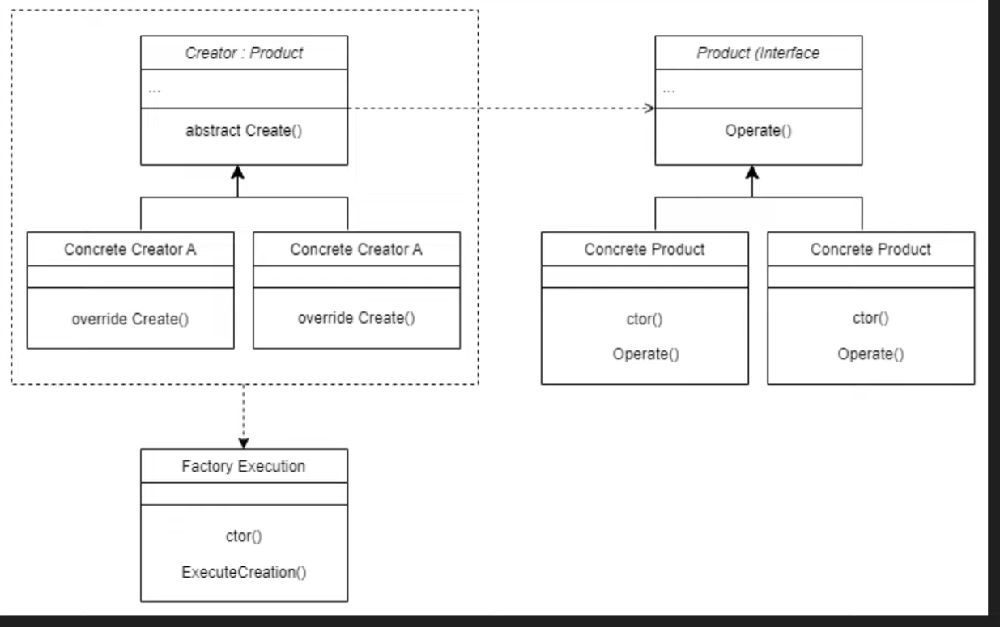

## 1. When to use a Factory Method design pattern?

- If we need to create an instance of a new object/product, but we don't know an exact type during runtime. 
---
## 2. There are two ways of using a factory method design pattern:
- using a lot of if/else statements to determine a type to create
- using reflection to detect a type from assemblies
### When to choose which?
- Use **if/else** when:
  - application is small/straightforward
  - we write a performance-critical system
- Use **Reflection** when:
  - we fetch types from external configuration
  - the system is highly extensible
  - having a lot of possible types to create

Usually we use class called ``FactoryProvider`` to get concrete factory of product:

```C#
public class PaymentFactoryProvider
{
    private readonly Dictionary<PaymentType, PaymentFactory> _factories;

    public PaymentFactoryProvider()
    {
        // if/else approach
        _factories = new Dictionary<PaymentType, PaymentFactory>
        {
            { PaymentType.Blik, new BlikPaymentFactory() },
            { PaymentType.CreditCard, new CreditCardPaymentFactory() },
            { PaymentType.PayPall, new PayPalPaymentFactory() }
        };
        
        // reflection approach
        _factories = new Dictionary<PaymentType, PaymentFactory>();

        foreach (var paymentType in Enum.GetValues<PaymentType>())
        {
            var factory = Assembly.GetExecutingAssembly().CreateInstance($"FactoryMethod.Factories.{paymentType}PaymentFactory") as PaymentFactory;
            _factories.Add(paymentType, factory!);
        }
    }

    public PaymentFactory GetPaymentFactory(PaymentType paymentType)
    {
        return _factories[paymentType];
    }
}
```

Example Video with FactoryProvider and reflection: https://www.youtube.com/watch?v=j_0ENoBi6W4&t=609s

---
## 3. Difference between Simple Factory and Factory Method
- Simple Factory contains only **ONE FACTORY** in which we specify which type we need to create
```C#
// ONE Factory for creating specific Payment
public class PaymentFactory{
    public Payment CreatePayment(Payments paymentType, decimal amount, Currencies currency){
        switch(paymentType){
            case PayPal:
                return new PayPalPayment;
            case CreditCard:
                return new CreditCardPayment;
            default:
                throw new NotImplementedException();
        }
    }
}

// client code
PaymentFactory factory = new PaymentFactory();
Payment payment = factory.CreatePayment(Payments.PayPal, 100, Currencies.USD);
```

- In Factory Method **each product has its own factory**
``` C#
// contract for factories
public abstract class PaymentFactory{
    public abstract Payment CreatePayment(decimal amount, Currencies currency);
}

// concrete factory
public class PayPalPaymentFactory : PaymentFactory{
    public override Payment CreatePayment(decimal amount, Currencies currency){
        return new PayPalPayment(amount, currency);
    }
}

// concrete factory
public class CreditCardPaymentFactory : PaymentFactory{
    public override Payment CreatePayment(decimal amount, Currencies currency){
        return new CreditCardPayment(amount, currency);
    }
}

// factory provider
// we could use if/else statements or reflection
public class PaymentFactoryProvider()
    public PaymentFactory GetFactory(Payments paymentType){
        switch(paymentType){
            case PayPal:
                return new PayPalPaymentFactory();
            case CreditCard:
                return new CreditCardPaymentFactory();
            default:
                throw new NotImplementedException();
        }
    }
}

// client code
PaymentFactoryProvider factoryProvider = new PaymentFactoryProvider();
PaymentFactory factory = factoryProvider.GetFactory(Payments.PayPal);
```

## 4. Takeaways
- Factory Method is a design pattern that provides an interface for creating objects in a superclass, but allows subclasses to alter the type of objects that will be created.
- We need to create FactoryProvider, and it's the only service we need to inject to client's code

## 5. Factory Method general UML diagram
